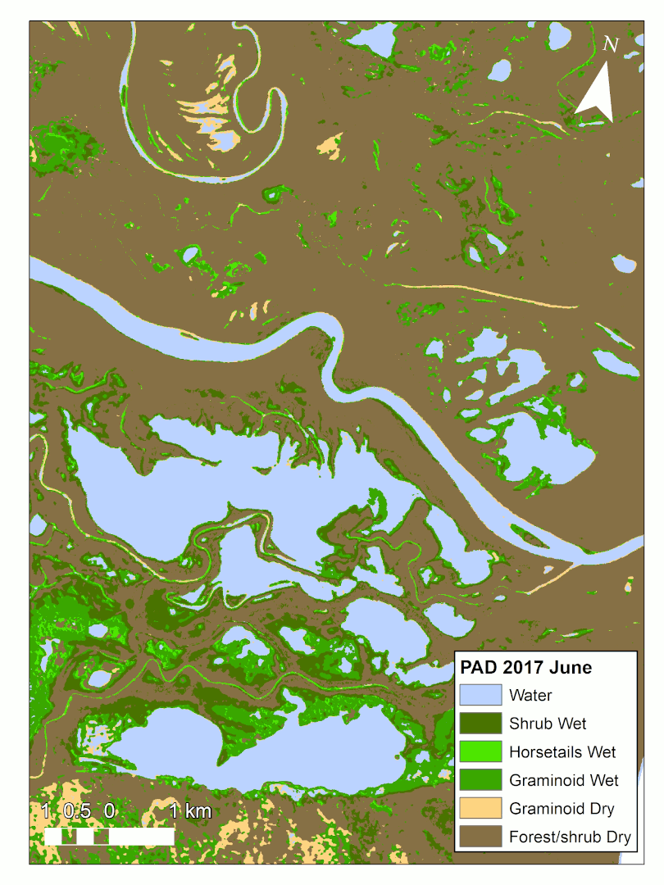

# Instructions for using these scripts
<p align="center">
      
</p>
These instructions are designed for the Above Science Cloud (ASC) environment, but you will need to install the required packages and conda env  beforhand, regardless!

<p align="center">
      
</p>

## Workflow for extracting stats for all lakes observed by UAVSAR:
1. Run classification in Matlab and analysis/reclass_rasters.py
2. analysis/upscaleFromLandcover.ipynb
3. analysis/Raster2PercentageLakePoly.py (Polygonizes landcover map to lake polygons, with attributes for EM%, whether or not it is a border lake, and whether it was observed by AirSWOT CIR camera.)


## Workflow for extracting stats for dozen or so visited lakes:
1. Run classification in Matlab and analysis/reclass_rasters.py
2. analysis/Raster2PercentagePoly.py (Convert a land cover raster to a shapefile, with attributes for fractional class coverage)
3. analysis/calcVegAreaFromPts.py (An automatic way of calculating littoral fraction from a shapefile of water bodies and a list of points)
4. analysis/Average_em.ipynb (Averages em_fraction for each site along all available dates)

Note: If running over maximum ROI, use the ROI file: 'ROI-analysis_albers.shp'. If running me under ROI common to all acquisition dates, use ROI file: 'ROI-analysis_albers-sub.shp'. When toggling between these two ROIs, be sure to to update vars 'file_basenames' and 3 others with tag #sub-roi.
        
## Workflow for sensitivity figure:

Be sure to update file paths in [python_env.py](analysis/python_env.py) and filepath vars in [Raster2PercentageLakePoly.py](analysis/Raster2PercentageLakePoly.py) before running

## Workflow for further analysis and plots:
1. lake-histograms-multi-temporal.ipynb
2. lake-bar-chart-time-series.ipynb
3. lake-histogram-by-area-etc.ipynb

## Workflow for Polarimetric SAR decomposition using PolSAR Pro and Random Forests classification in Matlab
1. Run polsar pro workflow in parallel using the following command:
>```
> bash polsar_pro/parallel_cat_run.sh polsar_pro/psp_workflow_function.sh [path/to/textfile/with/input/IDs] [number of cores]
>```
> Number of cores: 2 recommended to conserve memory on ASC, since each function call will need ~40 GB of mem max dand cause un-noticed errors if memory limit is exceeded
If using slurm to run a batch job, substitute `slurm` for `bash` in the above command.

2. In matlab: [trainingImageImport.m](trainingImageImport.m)

3. If reclassifying raster, use python: [analysis/reclass_rasters.py](analysis/reclass_rasters.py)
4. 
## Workflow for Look-up Table (LUT)-based classification
* This method was used for the Daring Lake scenes (CSD) only.

1. Activate conda environment. On ASC, the command would be:

>```
>conda activate base
>```
2. Move original GRD files to default_grd folder, using the script [polsar_pro/psp_mv_hgt_slope_inc_function.sh](polsar_pro/psp_mv_hgt_slope_inc_function.sh).
3. Run python script [radiocal_example_script_ek.py](https://github.com/ekcomputer/UAVSAR-Radiometric-Calibration/blob/master/python/radiocal_example_script_ek.py) located in an additional forked [repo](https://github.com/ekcomputer/UAVSAR-Radiometric-Calibration).
4. Continue with step 1. of regular workflow, [above](#workflow-for-look-up-table-(lut)-based-classification).
